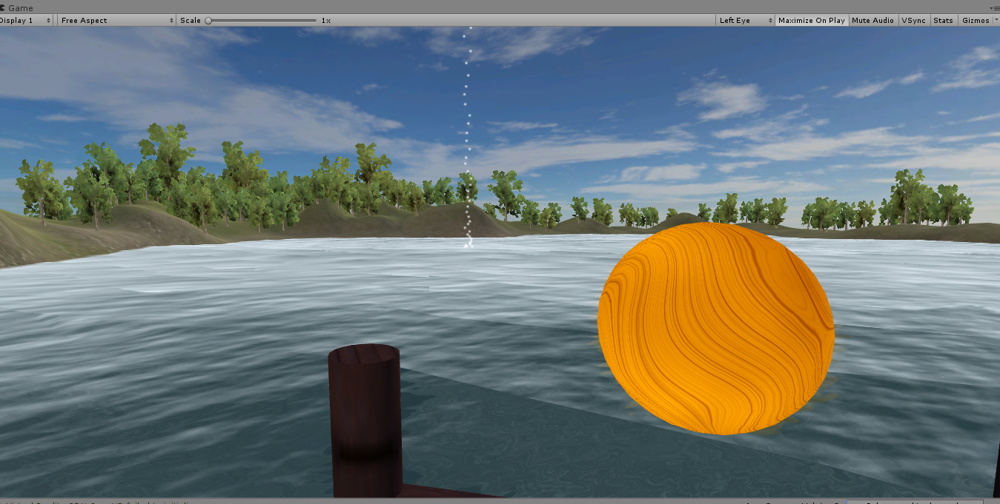
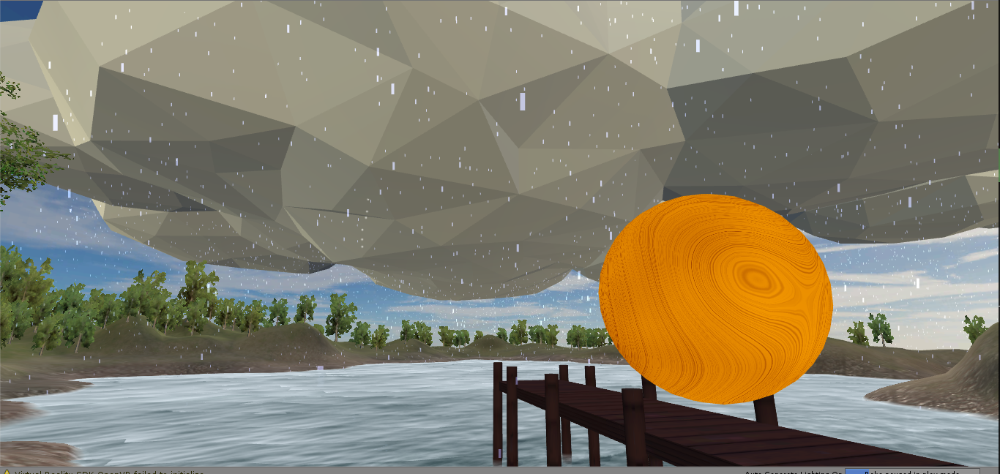
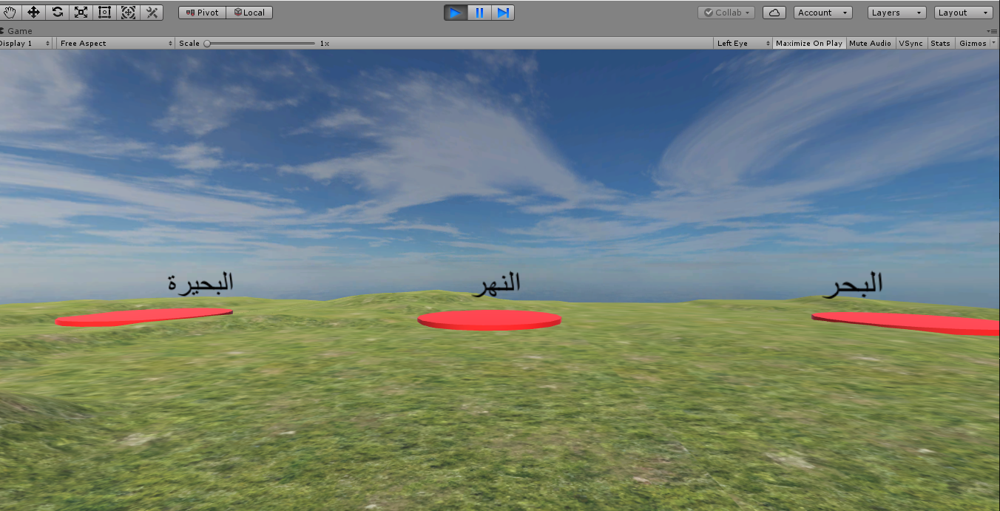
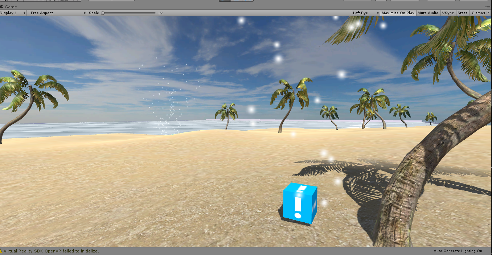
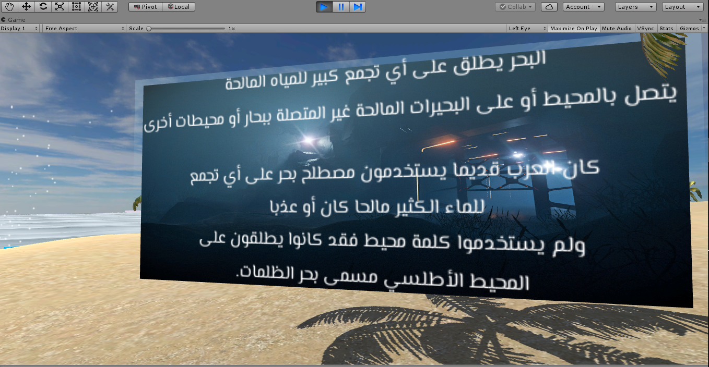
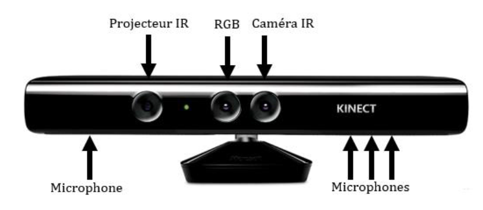
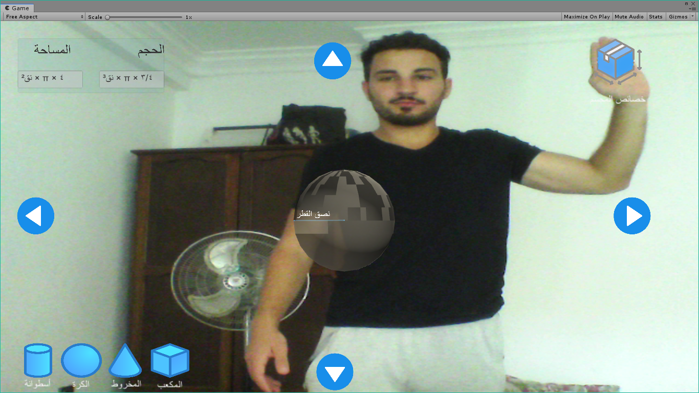
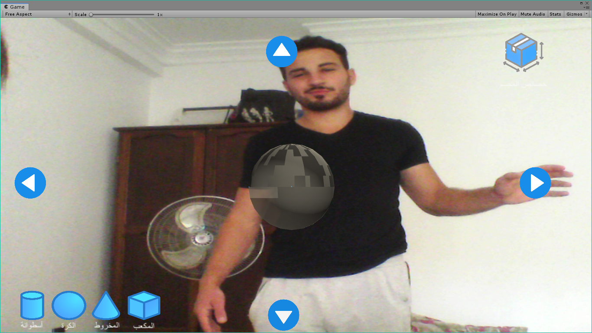

# VR-AR_educational_games
These are educational games developed with Unity3D that will be integrated later in an E-learning platform for children
	*Activity_GeographyVR: An exercise using the Oculus Rift and the xbox 360 controller, allows the learner to explore and differentiate between the expanses of water.
	*Activity_WaterCycleVR: An exercise using the Oculus Rift and the xbox 360 controller, which explains the different stages of the water cycle.
	*Activity_AR : a 3D representation for geometry forms exercice, includs their air and volume calculations. Where the learner can rotate the model and see it in 360° through a gesture recognition system using Microsoft Kinect. 
# Run the project and Test it

In order to test my project you can download it as a Zip file, unzip it and run the ".exe" files 
You can play it with a VR Casque and Xbox 360 controller or just your Labtop and a mouse.

Tools Used : 
	Unity 🎮
	Visual Studio 💾
	Blender 🔮
	
	
 Graphical representation of the interfaces
 
 The first two interfaces that the player sees when connecting the headphones and the
 Launch of the water cycle course are the game controls and the entry menu of the game:

After understanding the controls of the game, the student will launch into the lake and start looking for the sphere that is supposedly the sun in the scene. When he finds it, he will use the joystick keys to control the temperature of the orb. As soon as the orb is active and has reached the correct temperature, the water of the scene will begin to evaporate, a cloud will form and it will begin to rain as illustrated in the two following figures:

As for the courses of the expanses of the water, we add an initial scene which gives the pupil the possibility to choose between the sea, the river and the lake:

After choosing one of the water masses, the pupil is faced with an environmental exploration where he will find information cubes containing the characteristics of each mass as it is shown in the following interfaces:

Let's pass Now to the AR activity which requires a Microsoft Kinect V1 to work, because it is based on  gesture recognition:

In this activity, the real scene captured by the camera will be equipped with virtual objects superimposed on the scene (buttons, geometric shapes in 3D, panels of descriptions) as it is presented in the following interfaces.
Through the gestures introduced by the Kinect, the user can rotate 360 ° geometric shapes, it can change between the different forms that exist and display the formula for calculating air and volume for each figure

	
